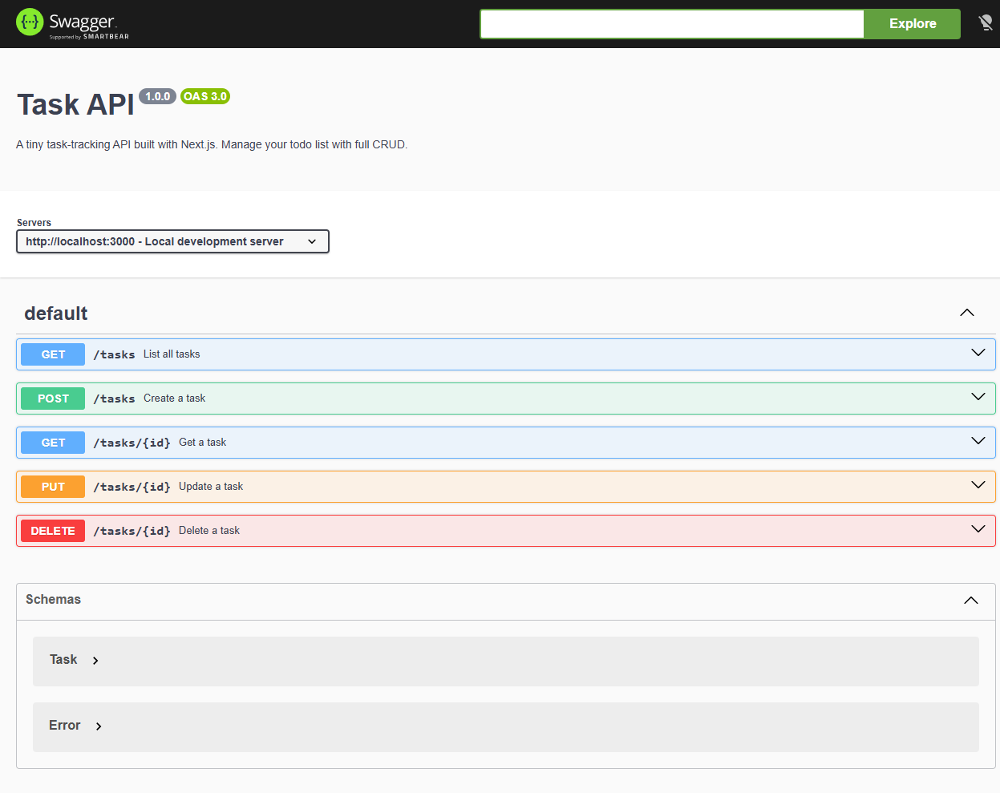

# Task API

A tiny, deliberately small JSON API for managing a to-do list — built with
[Next.js](https://nextjs.org) (App Router) and documented live with Swagger UI.
It exists to teach the shape of an API: routes, HTTP methods, status codes, and
request/response bodies — all in one folder you can read top to bottom.

The data is persisted to a real SQLite database (`data/tasks.db`) using Node's
built-in `node:sqlite` — so tasks survive a server restart. All SQL lives in the
repository layer; routes and services never talk to the database directly.

### Why SQLite?

We deliberately picked SQLite over Postgres/MySQL for this teaching project:

- **Single file.** The entire database is one file (`data/tasks.db`). There is no
  server process to install, configure, or keep running — the app just opens the
  file.
- **Zero setup.** It ships inside Node (the built-in `node:sqlite` module), so
  there is nothing extra to download or authenticate against.
- **Survives restarts.** Because state lives in that file, tasks are still there
  after you stop and start the server — no seeding-by-hand, no migration step.

That last point is the whole lesson of this project: a real backend keeps its
state somewhere that outlives the process. SQLite is the smallest possible
"somewhere," and almost every production database is the same idea at larger
scale.

## What's inside

The code is split into three layers so each file has one job:

- **routes** (`app/**/route.js`) — parse HTTP, map service errors to status codes. Stay thin.
- **service** (`app/lib/services/taskService.js`) — business rules: filtering, stats, and validation. Throws typed errors.
- **repository** (`app/lib/repositories/taskRepository.js`) — the SQLite store and pure CRUD (all `SELECT`/`INSERT`/`UPDATE`/`DELETE` live here).
- **errors** (`app/lib/errors.js`) — `ValidationError` (→ 400) / `NotFoundError` (→ 404) + HTTP mapper.

| File                                     | Layer      | Purpose                                             |
|------------------------------------------|------------|-----------------------------------------------------|
| `app/tasks/route.js`                     | route      | `GET` (list) and `POST` (create) for `/tasks`       |
| `app/tasks/[id]/route.js`                | route      | `GET` / `PUT` / `DELETE` for a single task          |
| `app/stats/route.js`                     | route      | `GET` task statistics                               |
| `app/reset/route.js`                     | route      | `POST` reset to seed tasks                          |
| `app/lib/services/taskService.js`        | service    | Filtering, stats, validation, orchestration         |
| `app/lib/repositories/taskRepository.js` | repository | SQLite task store and CRUD helpers                  |
| `app/lib/errors.js`                      | shared     | Typed errors and the HTTP error mapper              |
| `openapi.json`                           | —          | OpenAPI 3.0 description of every endpoint           |
| `server.mjs`                             | —          | Custom server: Swagger UI at `/docs`, forwards rest |
| `docs/swagger-ui.png`                    | —          | Screenshot of the Swagger UI (see below)            |

## Install & run

**One command gets you a working app:**

```bash
npm install && npm run dev
```

That's it. No database to install, no connection string to set. The first time the
server starts it creates `data/tasks.db` automatically (if it doesn't exist) and
seeds three example tasks — so a stranger cloning this repo and running that one
command has a running API with data in well under five minutes.

Requires [Node.js](https://nodejs.org) 18+ (the code uses the built-in
`node:sqlite`, so use Node 22.5+ for the stable API).

Then open:

- **API root / health:** http://localhost:3000
- **Swagger UI (interactive docs):** http://localhost:3000/docs
- **Raw OpenAPI spec:** http://localhost:3000/openapi.json

In Swagger UI, click **Try it out** on any endpoint and hit **Execute** — no
`curl` needed. The server, docs, and requests all live on the same origin, so
"Try it out" just works.

> Production build: `npm run build && npm start`.

## Where the database lives

- **File:** `data/tasks.db` (relative to the repo root).
- **Created automatically** by `app/lib/repositories/taskRepository.js` on first
  import — it makes the `data/` directory, runs `CREATE TABLE IF NOT EXISTS`, and
  inserts the three seed tasks only when the table is empty.
- **Git-ignored.** `data/` and `*.db` are in `.gitignore`, so the file is never
  committed. Every fresh clone starts with *no* database and gets one on first
  run — your local tasks stay local.
- **Open it yourself.** Grab [DB Browser for SQLite](https://sqlitebrowser.org)
  (free), choose **Open Database**, and point it at `data/tasks.db`. You're
  looking at the exact same rows the API serves.

### Why migrations exist (a peek ahead)

The table didn't always have `created_at` / `updated_at` columns — adding them
meant editing the table's shape, not just its rows, and that turned out to be
surprisingly fiddly (you can't `ALTER TABLE` with a `datetime('now')` default,
so existing rows had to be backfilled by hand). That small taste of "the data is
already there and now the schema changed" is exactly the problem database
migrations exist to solve cleanly.

  


## Endpoints

Base URL: `http://localhost:3000`

| Method   | Path          | Description                                                                                                                                                                                                                                                               | Success              | Errors                       |
|----------|---------------|---------------------------------------------------------------------------------------------------------------------------------------------------------------------------------------------------------------------------------------------------------------------------|----------------------|------------------------------|
| `GET`    | `/tasks`      | List all tasks, ordered alphabetically by `title` (`ORDER BY title`). Add `?search=milk` for a case-insensitive title substring match (SQL `LIKE`), and/or `?done=true` / `?done=false` to filter by status (SQL `WHERE done = ?`). Filters combine, all in the database. | `200` + JSON array   | —                            |
| `GET`    | `/stats`      | Computed counts: `{ "total", "done", "open" }`                                                                                                                                                                                                                            | `200` + JSON object  | —                            |
| `POST`   | `/reset`      | Clears all tasks and restores the 3 seed examples                                                                                                                                                                                                                         | `200` + JSON array   | —                            |
| `POST`   | `/tasks`      | Create a task (body: `{ "title": "string" }`)                                                                                                                                                                                                                             | `201` + the new task | `400` if title missing/empty |
| `GET`    | `/tasks/{id}` | Get one task by id                                                                                                                                                                                                                                                        | `200` + the task     | `404` if not found           |
| `PUT`    | `/tasks/{id}` | Update title and/or `done` (`{ "title"?, "done"? }`)                                                                                                                                                                                                                      | `200` + updated task | `400` / `404`                |
| `DELETE` | `/tasks/{id}` | Delete a task                                                                                                                                                                                                                                                             | `204` (no body)      | `404` if not found           |

### Task shape

```json
{ "id": 1, "title": "Learn what an API is", "done": true }
```

### Example: create a task

```bash
curl -i -X POST http://localhost:3000/tasks \
  -H 'Content-Type: application/json' \
  -d '{"title":"Try the README example"}'
```

```http
HTTP/1.1 201 Created
X-Powered-By: Express
vary: rsc, next-router-state-tree, next-router-prefetch, next-router-segment-prefetch
content-type: application/json
Date: Sat, 18 Jul 2026 13:50:06 GMT
Connection: keep-alive
Keep-Alive: timeout=5
Transfer-Encoding: chunked

{"id":4,"title":"Try the README example","done":false}
```

## Swagger UI



All endpoints are documented in `openapi.json` and rendered as interactive
documentation at `/docs`. The screenshot above shows the full list; each row
expands to show parameters, request body, and every response code.

## Explore the database directly (Stage 4)

The API is just a thin window onto a SQLite file: `data/tasks.db`. There is no
in-memory copy and no "syncing" — the API and any other reader (including
[DB Browser for SQLite](https://sqlitebrowser.org), free) read and write the
exact same file. That file is the single source of truth.

Open `data/tasks.db` in DB Browser, go to the **Execute SQL** tab, and try these.
The rows below are what was in the database at the time of writing:

```sql
SELECT * FROM tasks;
-- → 4 rows (ids 1–4):
--   {id:1, title:"Learn the repository pattern", done:0}
--   {id:2, title:"Build the service layer",      done:0}
--   {id:3, title:"Ship the API",                 done:1}
--   {id:4, title:"Buy oat milk",                 done:1}

SELECT * FROM tasks WHERE done = 1;
-- → only the completed tasks: ids 3 and 4.

SELECT COUNT(*) FROM tasks;
-- → 4
```

> **Saved query (for the record):** `SELECT * FROM tasks WHERE done = 1;` returned
> the completed tasks in the database I was exploring (ids 3 and 4 at the time).
> On a brand-new clone you'll instead see just the three seed tasks — two of them
> unfinished and "Ship the API" already done — because the API and DB Browser read
> this one file.

**Try the round-trip yourself:** in DB Browser, run `UPDATE tasks SET done = 1;`
(or insert/delete a row), then call `GET /tasks` from the API. The change shows
up immediately — no server restart — because the server runs `SELECT * FROM
tasks` on every request; it never caches the table in memory.

One caveat worth knowing: while the API server is running it holds an open
connection to `tasks.db`, so a *concurrent external writer* (DB Browser, or
another process) may briefly see **"database is locked"** when it tries to write.
Reads are always fine. If you hit the lock, stop the dev server, make your edit,
then start it again — the data is right there in the file either way. (SQLite
writes are serialized; this is normal and not a bug in the app.)

## Persistence, not mortality

Create a few tasks, restart the server, and `GET /tasks` — the tasks are still
there. That's the whole point of Stage 1–3: the repository writes every change to
`data/tasks.db` (`node:sqlite`), so state outlives the process. Every serious
backend on Earth is this idea, wearing more clothes.

> Note: `data/` is git-ignored, so the database file is local to your machine and
> not committed. The 3 seed examples are re-created automatically if the table
> is ever empty.
