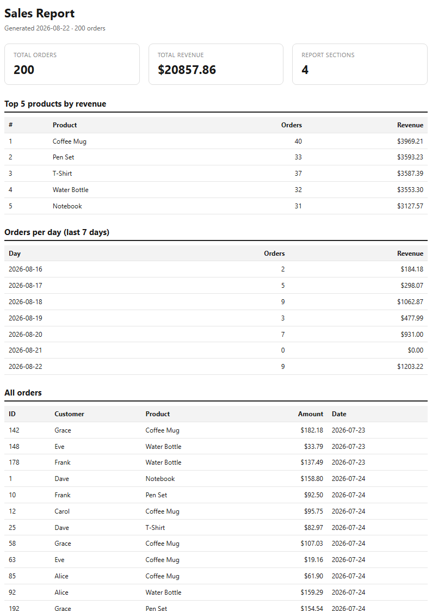

# A8 · PDF Report Generator

Build the workshop's report pipeline from scratch: **query → render → store → serve**.
One SQL query turns rows into numbers, an HTML template turns numbers into a page, and a
headless browser prints that page to a real PDF. The API generates the report and hands it out
by link — no background jobs required.

This is the **JavaScript lane**: Node.js + Express + SQLite (`node:sqlite`) + Playwright.

## Dataset

**Option A — the little shop.** A SQLite database `report.db` with one table `orders`
(`id`, `customer`, `product`, `amount`, `created_at`). The seed script (`seed.mjs`) wipes
and re-inserts **200 random orders**: 6 products, amounts $5–$200, dates in the last 30 days.
Running it twice leaves exactly one clean copy (safe to run twice).

## Stages

| Stage | What it does                                                   | Status |
|-------|----------------------------------------------------------------|--------|
| 0     | Setup: `GET /health` + Playwright/Chromium installed           | ✅     |
| 1     | Seed a small SQLite database with data                         | ✅     |
| 2     | One SQL aggregation query (`getReportData()`)                  | ✅     |
| 3     | Render numbers into an HTML page, print to PDF with Playwright | ✅     |
| 4     | Store the PDF on disk + path in DB; serve it by link           | ✅     |
| 5     | Idempotency: same request twice → one report, one file         | ✅     |
| 6     | Publish + docs (this README)                                   | ✅     |
| 7     | README + polish + ≥7 honest commits                            | ✅     |

## Run it (a stranger can do this in < 5 minutes)

```bash
cd a8
npm install
npx playwright install chromium   # one-time browser download
npm run seed                      # builds report.db with 200 orders
npm start                        # API on http://localhost:3200
```

```bash
curl -i http://localhost:3200/health
# HTTP/1.1 200 OK
# {"status":"ok"}
```

### Generate + download a report

```bash
curl -i -X POST http://localhost:3200/reports
# 201 -> {"id":"<uuid>","file":"/reports/<uuid>/file"}

curl http://localhost:3200/reports/<uuid>          # the row + file link (404 if unknown)
curl -o my-report.pdf http://localhost:3200/reports/<uuid>/file   # downloads the real PDF
```

> Port `3200` by default — `3000` is the repo's root Next.js dev server and `3100` is `a7` on this machine.
> Override with `A8_PORT=xxxx npm start`.

## Aggregation SQL (pasted)

These are the four queries inside `getReportData()` (`report.mjs`) that turn 200 rows into
the report's numbers:

```sql
-- 1) Total orders
SELECT COUNT(*) AS totalOrders FROM orders;

-- 2) Total revenue
SELECT ROUND(SUM(amount), 2) AS totalRevenue FROM orders;

-- 3) Top 5 products by revenue  (GROUP BY + ORDER BY + LIMIT)
SELECT product,
       COUNT(*)              AS orders,
       ROUND(SUM(amount), 2) AS revenue
FROM orders
GROUP BY product
ORDER BY revenue DESC
LIMIT 5;

-- 4) Orders per day, last 7 days  (recursive date series + LEFT JOIN so zero days show)
WITH days AS (
  SELECT date('now', '-6 days') AS day
  UNION ALL
  SELECT date(day, '+1 day') FROM days WHERE day < date('now')
)
SELECT d.day,
       COUNT(o.id)                   AS orders,
       ROUND(COALESCE(SUM(o.amount), 0), 2) AS revenue
FROM days d
LEFT JOIN orders o ON o.created_at = d.day
GROUP BY d.day
ORDER BY d.day;
```

A recent run produced:

```
totalOrders : 200
totalRevenue: $20857.86
topProducts : Coffee Mug $3969.21 · Pen Set $3593.23 · T-Shirt $3587.39 · Water Bottle $3553.30 · Notebook $3127.57
```

Sanity rule: no single product's revenue may exceed `totalRevenue` — if it does, the bug is in
the query, not the data. `test-report.mjs` asserts this.

## POST → download proof

Fresh request (no report generated yet today):

```
$ curl -s -X POST http://localhost:3200/reports
HTTP 201
{"id":"4bc6ec22-62ff-42bc-9282-16eb1f96c5d6","file":"/reports/4bc6ec22-62ff-42bc-9282-16eb1f96c5d6/file"}

$ curl -s http://localhost:3200/reports/4bc6ec22-62ff-42bc-9282-16eb1f96c5d6
{"id":"4bc6ec22-62ff-42bc-9282-16eb1f96c5d6","file":"/reports/4bc6ec22-62ff-42bc-9282-16eb1f96c5d6/file","created_at":"2026-08-22 11:24:20"}

$ curl -s -o my-report.pdf http://localhost:3200/reports/4bc6ec22-.../file
HTTP 200, bytes=47617        # a real %PDF- file you can open
```

Idempotency (Stage 5): a second POST (same day, no `force`) returns the **same id with 200**
and creates **no new file**. `{"force": true}` generates a fresh one.

## When would you move this out of the request?

`POST /reports` runs the whole pipeline **in the request** and takes several seconds (a fresh
Chromium launch is the dominant cost). That is fine for one user clicking one button. You move it
out of the request — into a background job (the A7 pattern: enqueue, return 202 + a job id, poll
or webhook) — the moment reports get large, generation gets slower, or more than a handful of
users generate concurrently, because a multi-second synchronous request is fragile and holds the
user (and a server thread) hostage.

## Idempotency (Stage 5)

`POST /reports` is **idempotent per day**: if a report was already generated today, the endpoint
returns the existing one with `200` instead of regenerating (a double-click makes one file, not
two). Pass `{ "force": true }` to force a fresh report.

The same-request-twice check protects against **duplicate side effects from retries, double
clicks, and flaky networks** — the client may fire the request again, but the system only does the
work once. A real-world example where a missing check like this costs money: a "charge card" or
"send invoice" endpoint that isn't idempotent will **bill or email a customer twice** when they
double-click "Pay" or a timeout triggers a retry — duplicate charges, refunds, and support tickets
that erode trust and margin.

## Page 1 of a generated PDF



## Layout

```
a8/
  server.mjs        Express app + report pipeline + serve-by-link routes (Stages 0,4,5)
  report.mjs        getReportData() / getOrders() — the aggregation layer (Stage 2)
  render.mjs        standalone HTML->PDF renderer (renderReport) + buildHtml (Stage 3)
  seed.mjs          wipes + seeds report.db (safe to run twice) (Stage 1)
  test-report.mjs   prints the report object as JSON (Stage 2 checkpoint)
  shot.mjs          dev helper: screenshot page 1 for this README (Stage 6)
  count.mjs         quick row-count helper
  package.json
  .gitignore        ignores node_modules/, reports/, *.db (the screenshot is an exception)
  data/             SQLite file (gitignored)
  reports/          generated PDFs (gitignored) — page1.png is committed as a doc asset
```

> `report.db` and `reports/*.pdf` are gitignored. The seed script (`npm run seed`) is their recipe,
> so anyone cloning this repo can regenerate everything.
